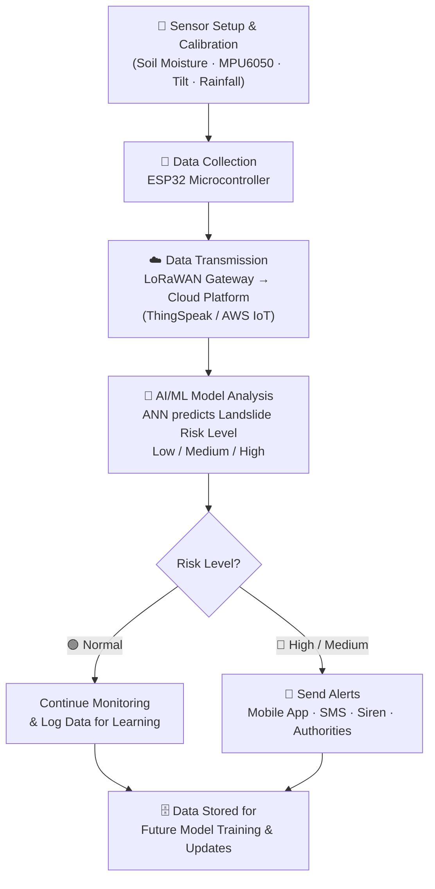
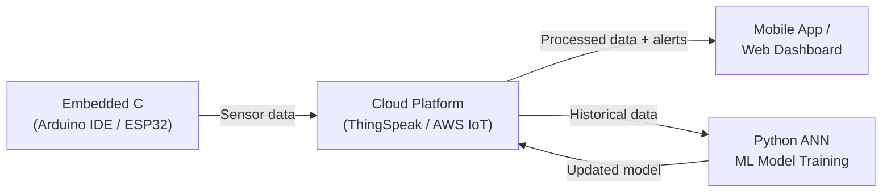
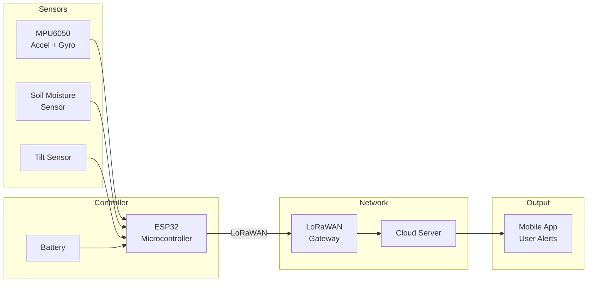

# AI & IoT-Based Landslide Alert System

> **Silicon Labs – Centre of Innovation in IoT | KIIT University, Bhubaneswar**  
> **Team:** AKAZA_EIC2025 &nbsp;|&nbsp; **Solution Area:** Smart City System  
> **Submission Deadline:** May 31, 2026 &nbsp;|&nbsp; **Platform:** [SiliconLabsSoftware/community-creations](https://github.com/SiliconLabsSoftware/community-creations)

---

## 1. Project Overview

The **AI & IoT-Based Landslide Alert System** is a smart disaster-prevention solution designed to **detect, predict, and alert** people about possible landslides in hilly regions. It is intended for rural communities, local authorities, schools, and disaster management agencies in landslide-prone areas who currently lack affordable early-warning infrastructure.

The system uses IoT sensors to continuously monitor environmental conditions — soil moisture, ground vibration, slope tilt, and rainfall — and transmits the data wirelessly via LoRaWAN to a cloud platform. There, an Artificial Neural Network (ANN) model classifies the risk level as **Low / Medium / High** and triggers alerts through a mobile app, SMS, or a local siren.

The project exists because conventional geotechnical monitoring systems cost ₹50,000+ per installation and require expert setup, making them inaccessible to the rural communities most at risk. This system achieves comparable functionality at **₹2,000–3,000 per unit**, making it deployable at scale as a smart city safety component.

---

## 2. Technical Architecture

### End-to-End System Workflow



### Software Stack Flow



### Hardware Block Diagram



---

## 3. Technologies Used

**Wireless / Communication Technologies**
- LoRaWAN — long-range, low-power wireless transmission from sensor node to gateway
- GSM — SMS-based fallback alert delivery
- Wi-Fi — cloud data upload and remote monitoring

**SDKs / Frameworks**
- Arduino ESP32 Core (ESP-IDF abstraction layer)
- ThingSpeak IoT Platform / AWS IoT Core
- TensorFlow / Keras or scikit-learn (ANN model training)

**Programming Languages**
- Embedded C / Arduino C++ — ESP32 firmware
- Python — ML model training, evaluation, and data preprocessing

**Tools**
- Arduino IDE / PlatformIO
- Python (Jupyter Notebook for model development)
- GitHub Actions (CI for linting and build checks)
- Simplicity Studio (planned for future EFR32 integration)

---

## 4. Hardware Components

**Silicon Labs Hardware**

> The current prototype uses ESP32 as the main controller. The architecture is designed with a migration path to Silicon Labs **EFR32 Series 2** wireless SoCs (e.g., EFR32MG21/EFR32BG22) for production-grade, certified LoRa/BLE connectivity and ultra-low-power operation — fully compatible with Simplicity Studio and the Gecko SDK.

- Target migration: EFR32MG21 SoC (multi-protocol wireless MCU)
- Development Kit reference: SLWSTK6006A / BRD4181B Radio Board

**External Hardware**

| Component | Function |
|---|---|
| ESP32 Microcontroller | Main processor — collects sensor data, runs alert logic, handles LoRaWAN communication |
| MPU6050 (Accelerometer + Gyroscope) | Detects vibrations and ground movements indicating slope instability |
| Soil Moisture Sensor | Measures water content in the soil — high moisture correlates with increased landslide risk |
| Tilt Sensor | Monitors slope angle changes indicating ground deformation or movement |
| LoRaWAN Gateway (e.g., RAK2245) | Receives wireless data from the ESP32 and forwards to the cloud server |
| Battery / Solar Panel + Charge Controller | Provides autonomous power for field deployment |
| Mobile Phone (User App) | Displays real-time sensor data and pushes alert notifications |

Tools used during development:
- Multimeter / logic analyzer (for hardware debugging)
- USB-UART adapter (for serial monitoring)

---

## 5. Getting Started

### Prerequisites

- Arduino IDE v1.8+ or PlatformIO with ESP32 board support installed
- Python 3.8+ with `numpy`, `pandas`, `scikit-learn` / `tensorflow`
- ThingSpeak account (free tier) or AWS IoT Core account
- LoRaWAN Gateway with TTN (The Things Network) or private server configured

### Hardware Setup

1. Wire all sensors to the ESP32 as per the circuit diagram in `resources/circuit_diagram.png`.
2. Connect the LoRaWAN module to the ESP32 via SPI/UART.
3. Power the unit from a 3.7V LiPo battery or a 5V solar panel with charge controller.

### Firmware Upload

```bash
# 1. Clone the repository
git clone https://github.com/<your-username>/akaza-landslide-alert.git
cd akaza-landslide-alert

# 2. Open firmware in Arduino IDE
#    File: projects/esp32_firmware/landslide_alert.ino

# 3. Install required libraries via Library Manager:
#    - LoRa (by Sandeep Mistry)
#    - MPU6050 (by Electronic Cats)
#    - ThingSpeak (by MathWorks)

# 4. Edit credentials
#    projects/esp32_firmware/config.h  →  Wi-Fi SSID/Password, ThingSpeak API key

# 5. Select board: "ESP32 Dev Module", then Upload
```

### ML Model Training

```bash
cd projects/ml_model/
pip install -r requirements.txt
python train_ann.py
# Trained model saved to: projects/ml_model/saved_model/ann_landslide.pkl
```

---

## 6. Project Repository Structure

```
akaza-landslide-alert/
├── projects/
│   ├── esp32_firmware/            # Embedded C / Arduino firmware
│   │   ├── landslide_alert.ino
│   │   └── config.h               # WiFi / API credentials (do not commit secrets)
│   └── ml_model/                  # Python ANN training & evaluation
│       ├── train_ann.py
│       ├── model_eval.py
│       ├── dataset/               # Sample sensor dataset (CSV)
│       └── requirements.txt
├── resources/
│   ├── circuit_diagram.png
│   ├── hardware_components.png
│   └── workflow_diagram.png
├── .github/
│   ├── CODEOWNERS
│   ├── CONTRIBUTING.md
│   └── workflows/
│       └── build-check.yml
├── CODE_OF_CONDUCT.md
├── LICENSE.md
└── README.md
```

---

## 7. Software Components / Dependencies

**Silicon Labs Dependencies**

- Simplicity Studio v5 (planned for EFR32 migration)
- Gecko SDK v4.x (planned for EFR32 migration)
- Reference example: *LoRa Range Test* (EFR32 application — future target)

**External Software Dependencies**

| Library / Tool | Version | Purpose |
|---|---|---|
| Arduino ESP32 Core | ≥ 2.0 | ESP32 firmware development environment |
| LoRa (sandeepmistry) | ≥ 0.8.0 | LoRa radio communication |
| MPU6050 (Electronic Cats) | ≥ 1.0.0 | Accelerometer / gyroscope sensor reading |
| ThingSpeak Arduino Library | ≥ 2.0.0 | Cloud data upload and channel management |
| Python scikit-learn | Latest | ANN model training and evaluation |
| Python TensorFlow / Keras | Latest | Alternative deep learning training backend |
| pandas | Latest | Sensor data preprocessing and CSV handling |
| numpy | Latest | Numerical computation for model pipeline |

---

## 8. Licensing

This project is licensed under the **zlib License**.  
See [LICENSE.md](LICENSE.md) for the full license text.

Third-party components and their licenses:
- LoRa library by Sandeep Mistry — MIT License
- MPU6050 library by Electronic Cats — MIT License
- ThingSpeak library by MathWorks — MIT License
- scikit-learn — BSD 3-Clause License
- TensorFlow — Apache License 2.0

For guidance on choosing a license, see [choosealicense.com](https://choosealicense.com/).

---


---

## 9. Maintainers / Contacts

| Name | Role | Contact | GitHub Profile |
|---|---|---|---|
| Basundhara Banik | Project Lead | 2307024@kiit.ac.in | https://github.com/ |
| Saharsh | Hardware & Firmware | 2307044@kiit.ac.in | https://github.com/ |
| Yash Rout | ML & Cloud | yashrout2009@gmail.com | https://github.com/ |
| Aashna Rai | App & Dashboard | 2305672@kiit.ac.in | https://github.com/ |


---

## Repository Topics

Add these topics to your GitHub repository for discoverability:

`silicon-labs` `efr32` `esp32` `lorawan` `iot` `landslide-detection` `machine-learning` `ann` `smart-city` `disaster-management` `centre-of-innovation-in-iot` `kiit`

---

*Submitted as part of the **Silicon Labs – Centre of Innovation in IoT Lab** initiative, KIIT University, Bhubaneswar.*  
*Submission platform: [SiliconLabsSoftware/community-creations](https://github.com/SiliconLabsSoftware/community-creations) | Deadline: May 31, 2026*
